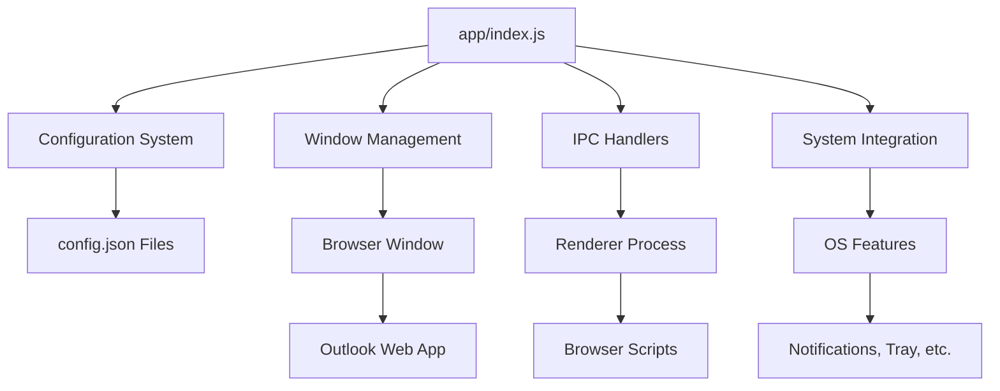

# GitHub Copilot Instructions for Outlook for Linux

> [!NOTE]
> **This is a quick reference for GitHub Copilot.** For comprehensive developer documentation including architecture, code standards, testing strategy, and detailed guidelines:
> - **Local Documentation**: See markdown files in `docs-site/docs/` directory (these are the source files)
> - **Development Guide**: `docs-site/docs/development/contributing.md`
> - **Claude Code Instructions**: See `CLAUDE.md` in the root directory for detailed code patterns and AI agent workflows
> - **Markdown Standards**: `docs-site/docs/development/contributing.md` (Markdown Standards section)
>
> **Important**: Read documentation from local markdown files in `docs-site/docs/` rather than fetching from the web.

## Project Overview

Outlook for Linux is an Electron-based desktop application that wraps the Outlook web app, providing a native desktop experience for Linux users with enhanced features like custom CSS, system notifications, and deep desktop integration. It is a fork of [teams-for-linux](https://github.com/IsmaelMartinez/teams-for-linux).

## Quick Reference

### Essential Commands

```bash
npm start              # Development mode with trace warnings
npm run lint          # ESLint validation (mandatory before commits)
npm run test:e2e      # End-to-end tests with Playwright
npm run pack          # Development build without packaging
npm run dist:linux    # Build Linux packages (AppImage, deb, rpm, snap)
```

### Key File Locations

- **Entry Point**: `app/index.js` - Main Electron process (being refactored - avoid adding new code here)
- **Configuration**: `app/appConfiguration/` - Centralized configuration management
- **Main Window**: `app/mainAppWindow/` - BrowserWindow and Outlook wrapper
- **Browser Scripts**: `app/browser/tools/` - Client-side injected scripts
- **Documentation**: `docs-site/docs/` - Docusaurus documentation site

### Code Standards Quick List

- ❌ **NO `var`** - Use `const` by default, `let` for reassignment only
- ✅ **Use `async/await`** instead of promise chains
- ✅ **Private fields** - Use JavaScript `#property` syntax for class members
- ✅ **Arrow functions** for concise callbacks
- ✅ **Run `npm run lint`** before all commits (mandatory)

### Critical Warnings

> [!IMPORTANT]
> **Preload IPC Initialization** - The `trayIconRenderer` and `webauthnOverride` modules MUST be included in the IPC initialization list in `app/browser/preload.js`. `trayIconRenderer` has been accidentally removed multiple times in git history. See issue #1902 and CLAUDE.md for details.

```javascript
// REQUIRED in app/browser/preload.js
const modulesRequiringIpc = new Set(["trayIconRenderer", "webauthnOverride"]);
if (modulesRequiringIpc.has(module.name)) {
  moduleInstance.init(config, ipcRenderer);
}
```

## Project Architecture



**For detailed architecture documentation**, see:
- Architecture Overview: `docs-site/docs/development/contributing.md` (Architecture Overview section)
- IPC API Documentation: `docs-site/docs/development/ipc-api.md`
- Module-specific READMEs in `app/` subdirectories

## Development Patterns

### Configuration Management

- All configuration managed through `AppConfiguration` class
- Treat config as **immutable after startup**
- Changes via AppConfiguration methods only
- See `docs-site/docs/configuration.md` for details

### Error Handling & Logging

- Use try-catch blocks in async functions
- Aim for graceful degradation
- Use `electron-log` for structured logging
- Avoid logging sensitive information

### IPC Communication

- Use `ipcMain.handle` for request-response patterns
- Use `ipcMain.on` for fire-and-forget notifications
- Add every new channel to the allowlist in `app/security/ipcValidator.js`
- Document all new IPC channels in `docs-site/docs/development/ipc-api.md`

### Defensive Coding

- Browser scripts must be defensive - Outlook DOM can change without notice
- Implement proper null checks and error handling
- Test across different platforms when possible

## Testing & Quality

- **Linting**: Run `npm run lint` before commits (mandatory)
- **E2E Tests**: Run `npm run test:e2e` - each test uses clean state
- **Manual Testing**: Use `npm start` for development testing
- **CI/CD**: GitHub Actions validates all PRs

For testing strategy details, see `docs-site/docs/development/contributing.md` (Testing section)

## Documentation

> [!IMPORTANT]
> **Documentation is a core responsibility** - update relevant documentation in the same PR as code changes.

### What to Update

- **Module READMEs**: Update when changing module functionality
- **IPC Documentation**: Document new IPC channels in `docs-site/docs/development/ipc-api.md`
- **Architecture Docs**: Update for architectural changes
- **Configuration**: Document new config options in `docs-site/docs/configuration.md`
- **ADRs**: Create Architecture Decision Records for significant technical decisions in `docs-site/docs/development/adr/`

### Documentation Platform

The project uses **Docusaurus** for documentation:
- **Source Files**: All documentation is in `docs-site/docs/` directory
- **Local Development**: `cd docs-site && npm run start`
- **Deployment**: Automated via GitHub Actions to GitHub Pages
- **Search**: Client-side search using @easyops-cn/docusaurus-search-local
- **Standards**: See `docs-site/docs/development/contributing.md` (Markdown Standards section)

## External Dependencies

- **Core**: Electron, electron-builder
- **System**: @homebridge/dbus-native (Linux desktop integration)
- **Storage**: electron-store (persistent configuration)
- **Audio**: node-sound (optional, for notification sounds)

## Additional Resources

**Local documentation files:**
- **Full Contributing Guide**: `docs-site/docs/development/contributing.md`
- **Configuration Reference**: `docs-site/docs/configuration.md`
- **Troubleshooting**: `docs-site/docs/troubleshooting.md`
- **IPC API**: `docs-site/docs/development/ipc-api.md`

**Project:**
- **Repository**: https://github.com/Taylor8484/outlook-for-linux
- **Documentation Site**: https://taylor8484.github.io/outlook-for-linux/ (web version for humans, once published)

---

**Remember**: Always consider cross-platform compatibility and that the Outlook web interface can change independently of this application.
