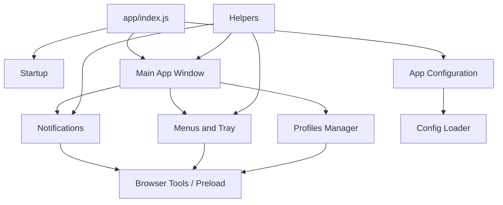

# Module Architecture Index

Comprehensive index of all application modules in the `app/` directory. Outlook for Linux follows a modular architecture where functionality is organized into focused, single-responsibility modules.

:::tip
Module READMEs are available in the GitHub repository. Click the documentation links to view detailed information about each module.
:::

## Core Modules

These modules form the foundation of the application and are essential for basic operation.

| Module | Path | Purpose | Documentation |
|--------|------|---------|---------------|
| **Startup** | `app/startup/` | Command line switches & initialization flags | [README](https://github.com/Taylor8484/outlook-for-linux/blob/develop-outlook/app/startup/README.md) |
| **Main App Window** | `app/mainAppWindow/` | Primary BrowserWindow that hosts the Outlook web app | [README](https://github.com/Taylor8484/outlook-for-linux/blob/develop-outlook/app/mainAppWindow/README.md) |
| **App Configuration** | `app/appConfiguration/` | Application-wide configuration management | [README](https://github.com/Taylor8484/outlook-for-linux/blob/develop-outlook/app/appConfiguration/README.md) |
| **Browser** | `app/browser/` | Preload script & client-side browser tools (tray icon rendering, title-based unread detection, shortcuts, zoom, WebAuthn override, platform emulation) | [README](https://github.com/Taylor8484/outlook-for-linux/blob/develop-outlook/app/browser/README.md) |

## Feature Modules

User-facing features and integrations.

| Module | Path | Purpose | Documentation |
|--------|------|---------|---------------|
| **Auto Updater** | `app/autoUpdater/` | In-app auto-update for AppImage distributions | [README](https://github.com/Taylor8484/outlook-for-linux/blob/develop-outlook/app/autoUpdater/README.md) |
| **Custom CSS** | `app/customCSS/` | Custom styling and themes | [README](https://github.com/Taylor8484/outlook-for-linux/blob/develop-outlook/app/customCSS/README.md) |
| **Notifications** | `app/notifications/` | Native desktop notifications & sound playback | [README](https://github.com/Taylor8484/outlook-for-linux/blob/develop-outlook/app/notifications/README.md) |
| **Notification System** | `app/notificationSystem/` | Custom in-app toast notifications | [README](https://github.com/Taylor8484/outlook-for-linux/blob/develop-outlook/app/notificationSystem/README.md), [ADR-022](./adr/022-custom-notification-toast-scope.md) |
| **Download Manager** | `app/downloadManager/` | Surfaces file download lifecycle as system notifications | [README](https://github.com/Taylor8484/outlook-for-linux/blob/develop-outlook/app/downloadManager/README.md) |
| **InTune SSO** | `app/intune/` | Microsoft InTune single sign-on integration | [README](https://github.com/Taylor8484/outlook-for-linux/blob/develop-outlook/app/intune/README.md), [User Guide](../intune-sso.md) |
| **Global Shortcuts** | `app/globalShortcuts/` | System-wide keyboard shortcuts | No README yet |
| **WebAuthn / FIDO2** | `app/webauthn/` | Hardware security key support for Linux via fido2-tools interception of navigator.credentials | [README](https://github.com/Taylor8484/outlook-for-linux/blob/develop-outlook/app/webauthn/README.md), [ADR-021](./adr/021-webauthn-fido2-linux.md) |
| **Client Certificate PIN** | `app/clientCertificate/` | Linux smartcard/NSS client-certificate PIN dialog built on the shared secure prompt | [README](https://github.com/Taylor8484/outlook-for-linux/blob/develop-outlook/app/clientCertificate/README.md), [ADR-024](./adr/024-smartcard-pkcs11-pin-dialog.md) |
| **Profiles Manager** | `app/profilesManager/` | Multi-account profile storage, switching, and lifecycle management | [README](https://github.com/Taylor8484/outlook-for-linux/blob/develop-outlook/app/profilesManager/README.md), [ADR-020](./adr/020-multi-account-profile-switcher.md) |
| **Profile Dialogs** | `app/profileDialogs/` | Add-profile, manage-profiles, and switch-profile UI dialogs | [ADR-020](./adr/020-multi-account-profile-switcher.md) |
| **Profile Switcher** | `app/profileSwitcher/` | Avatar pill overlay for switching between profiles | [README](https://github.com/Taylor8484/outlook-for-linux/blob/develop-outlook/app/profileSwitcher/README.md) |

## System Integration Modules

OS-level integrations and platform-specific functionality.

| Module | Path | Purpose | Documentation |
|--------|------|---------|---------------|
| **Login** | `app/login/` | Native HTTP Basic/NTLM login dialog handling | [README](https://github.com/Taylor8484/outlook-for-linux/blob/develop-outlook/app/login/README.md) |
| **SSO Password Pre-fill** | `app/ssoPasswordPrefill/` | Opt-in pre-fill of the Microsoft/federated **web** sign-in form: account, password from a command, optional auto-advance and MFA method. Distinct from `app/login/`, which drives the native HTTP Basic/NTLM dialog. | [README](https://github.com/Taylor8484/outlook-for-linux/blob/develop-outlook/app/ssoPasswordPrefill/README.md) |
| **Menus** | `app/menus/` | Application menu bar, tray menu and context menus | [README](https://github.com/Taylor8484/outlook-for-linux/blob/develop-outlook/app/menus/README.md) |
| **Spell Check Provider** | `app/spellCheckProvider/` | Text spelling correction integration | [README](https://github.com/Taylor8484/outlook-for-linux/blob/develop-outlook/app/spellCheckProvider/README.md) |
| **Background Portal** | `app/backgroundPortal/` | Flatpak background-running request and status reporting via `org.freedesktop.portal.Background` | [README](https://github.com/Taylor8484/outlook-for-linux/blob/develop-outlook/app/backgroundPortal/README.md) |

## Utility & Infrastructure Modules

Supporting infrastructure, utilities, and cross-cutting concerns.

| Module | Path | Purpose | Documentation |
|--------|------|---------|---------------|
| **Shared** | `app/_shared/` | Cross-module shared utilities, dialog window scaffolding and the hardened secure prompt | [README](https://github.com/Taylor8484/outlook-for-linux/blob/develop-outlook/app/_shared/README.md) |
| **Audio** | `app/audio/` | Sound playback via system audio commands (`paplay`, `pw-play`, `aplay`, `afplay`) | — |
| **Utils** | `app/utils/` | Shared utilities (window positioning, log sanitization, storage partitions) | — |
| **Helpers** | `app/helpers/` | Shared utility functions and common logic | [README](https://github.com/Taylor8484/outlook-for-linux/blob/develop-outlook/app/helpers/README.md) |
| **Cache Manager** | `app/cacheManager/` | Application cache handling | [README](https://github.com/Taylor8484/outlook-for-linux/blob/develop-outlook/app/cacheManager/README.md) |
| **Config** | `app/config/` | Configuration schema, file loading, parsing and validation | [README](https://github.com/Taylor8484/outlook-for-linux/blob/develop-outlook/app/config/README.md) |
| **Connection Manager** | `app/connectionManager/` | Network connectivity and connection state | [README](https://github.com/Taylor8484/outlook-for-linux/blob/develop-outlook/app/connectionManager/README.md) |
| **Partitions** | `app/partitions/` | Electron partition management for sessions | [README](https://github.com/Taylor8484/outlook-for-linux/blob/develop-outlook/app/partitions/README.md) |
| **Security** | `app/security/` | IPC channel validation and payload sanitization | No README yet |
| **Certificate** | `app/certificate/` | Custom certificate handling | [User Guide](../certificate.md) |

## UI Components

Special-purpose windows and UI elements.

| Module | Path | Purpose | Documentation |
|--------|------|---------|---------------|
| **GPU Info Window** | `app/gpuInfoWindow/` | GPU information display window | [README](https://github.com/Taylor8484/outlook-for-linux/blob/develop-outlook/app/gpuInfoWindow/README.md) |

## Assets

| Path | Purpose |
|------|---------|
| `app/assets/` | Icons, sounds, and static resources ([README](https://github.com/Taylor8484/outlook-for-linux/blob/develop-outlook/app/assets/README.md)) |

## Module Development Guidelines

### Creating New Modules

When adding a new module to the application:

1. **Create a dedicated directory** under `app/` with a descriptive name
2. **Add a README.md** documenting:
   - Module purpose and responsibilities
   - Public API and IPC channels (if any)
   - Dependencies on other modules
   - Usage examples
3. **Follow single responsibility principle** - one module, one clear purpose
4. **Use dependency injection** - accept dependencies as constructor/function parameters
5. **Document IPC channels** - add descriptive comments above IPC registrations
6. **Update IPC allowlist** - add new channels to `app/security/ipcValidator.js`
7. **Generate IPC docs** - run `npm run generate-ipc-docs` after adding IPC channels
8. **Add to this index** - update the appropriate category in this document

### Module Structure Best Practices

```
app/myModule/
├── README.md              # Module documentation
├── index.js               # Public interface / entry point
├── service.js             # Service class (if applicable)
└── preload.js             # Preload script (if needs IPC)
```

Unit tests live in `tests/unit/` and end-to-end tests in `tests/e2e/`.

### IPC Channel Guidelines

- **Naming convention**: `module-name:action` (e.g., `webauthn:create`)
- **Add descriptive comments** above `ipcMain.handle()` or `ipcMain.on()` calls
- **Register in allowlist**: Add to `app/security/ipcValidator.js`
- **Generate documentation**: Run `npm run generate-ipc-docs`
- **Document in module README**: List all IPC channels with descriptions

See [IPC API Documentation](ipc-api.md) for all available IPC channels.

## Architecture Patterns

### Module Dependencies

Modules are organized in a hierarchical dependency structure:



### Communication Patterns

- **IPC (Inter-Process Communication)**: Main process ↔ Renderer process
- **Event Emitters**: Within main process for loose coupling
- **Dependency Injection**: Pass dependencies explicitly, avoid global state
- **Configuration-First**: Modules read from centralized config object

## Related Documentation

- **Contributing Guide**: [Development Guidelines](contributing.md)
- **IPC API Reference**: [IPC Channel Documentation](ipc-api.md)
- **Configuration Options**: [Configuration Reference](../configuration.md)
- **Architecture Decisions**: [ADR Index](adr/README.md)

## Questions?

- **"Where should I add new functionality?"** → Check if an existing module fits, otherwise create a new focused module
- **"How do I communicate between modules?"** → Use dependency injection and IPC for renderer↔main communication
- **"Which modules are most important to understand?"** → Start with Core Modules, then explore Feature Modules
- **"How do I add a new IPC channel?"** → See [Module Development Guidelines](#module-development-guidelines) above
